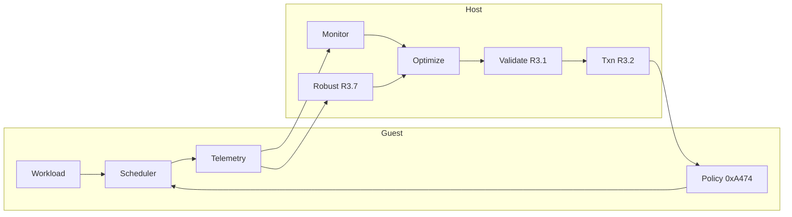

# Figure: AROS Architecture

```mermaid
flowchart LR
  subgraph Guest
    W[Workload]
    S[Scheduler]
    T[Telemetry]
    P[Policy 0xA474]
  end
  subgraph Host
    M[Monitor]
    O[Optimize]
    V[Validate R3.1]
    X[Txn R3.2]
    R[Robust R3.7]
  end
  W --> S --> T --> M --> O --> V --> X --> P
  T --> R --> O
  P --> S
```
