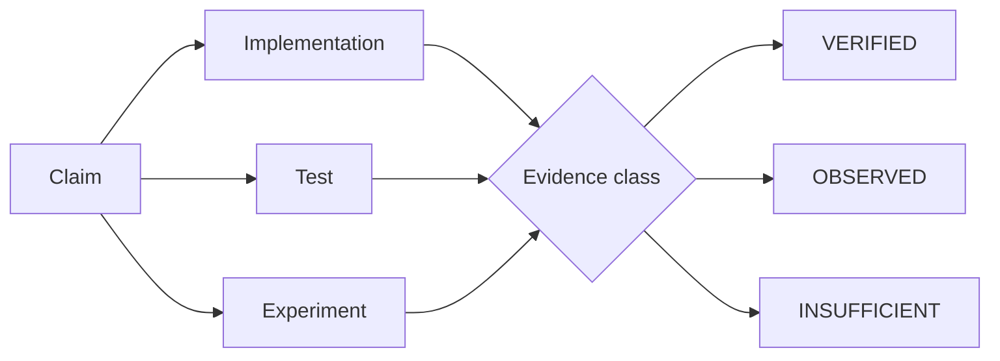

# Figure: Claim–Evidence Relationship

```mermaid
flowchart LR
  C[Claim] --> I[Implementation]
  C --> T[Test]
  C --> X[Experiment]
  I --> E{Evidence class}
  T --> E
  X --> E
  E --> V[VERIFIED]
  E --> O[OBSERVED]
  E --> N[INSUFFICIENT]
```
