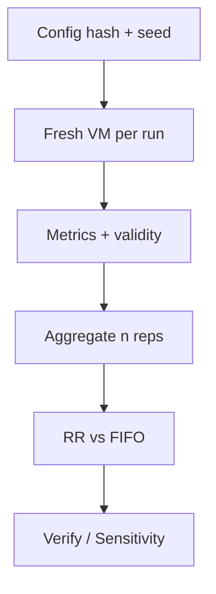

# Figure: Experiment Methodology

```mermaid
flowchart TD
  CFG[Config hash + seed] --> RUN[Fresh VM per run]
  RUN --> MET[Metrics + validity]
  MET --> AGG[Aggregate n reps]
  AGG --> CMP[RR vs FIFO]
  CMP --> VER[Verify / Sensitivity]
```
