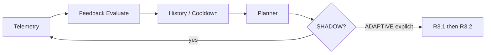

# Figure: Feedback Loop

```mermaid
flowchart LR
  T[Telemetry] --> F[Feedback Evaluate]
  F --> H[History / Cooldown]
  H --> P[Planner]
  P --> S{SHADOW?}
  S -->|yes| T
  S -->|ADAPTIVE explicit| X[R3.1 then R3.2]
```
