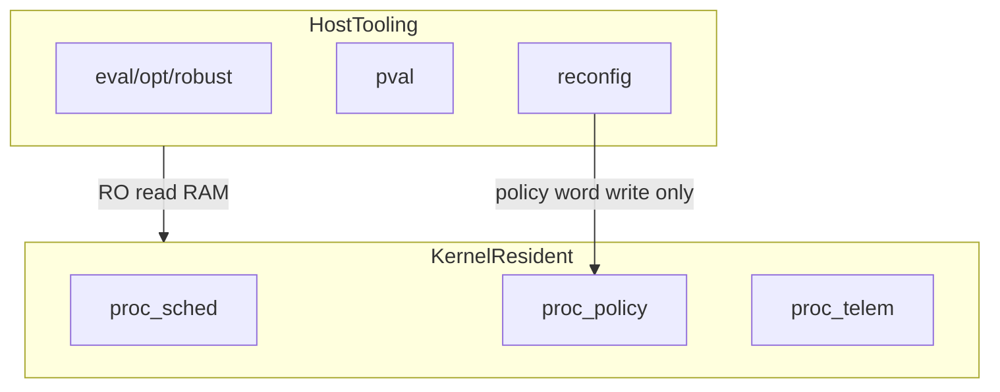

# Figure: Host / Kernel Boundary

```mermaid
flowchart TB
  subgraph KernelResident
    sched[proc_sched]
    policy[proc_policy]
    telem[proc_telem]
  end
  subgraph HostTooling
    eval[eval/opt/robust]
    pval[pval]
    recfg[reconfig]
  end
  HostTooling -->|RO read RAM| KernelResident
  recfg -->|policy word write only| policy
```
