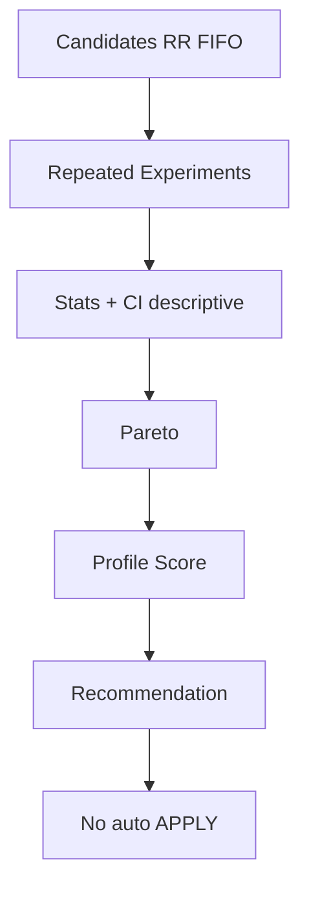

# Figure: Optimization Pipeline

```mermaid
flowchart TD
  C[Candidates RR FIFO] --> E[Repeated Experiments]
  E --> ST[Stats + CI descriptive]
  ST --> PA[Pareto]
  PA --> SC[Profile Score]
  SC --> REC[Recommendation]
  REC --> SEP[No auto APPLY]
```
