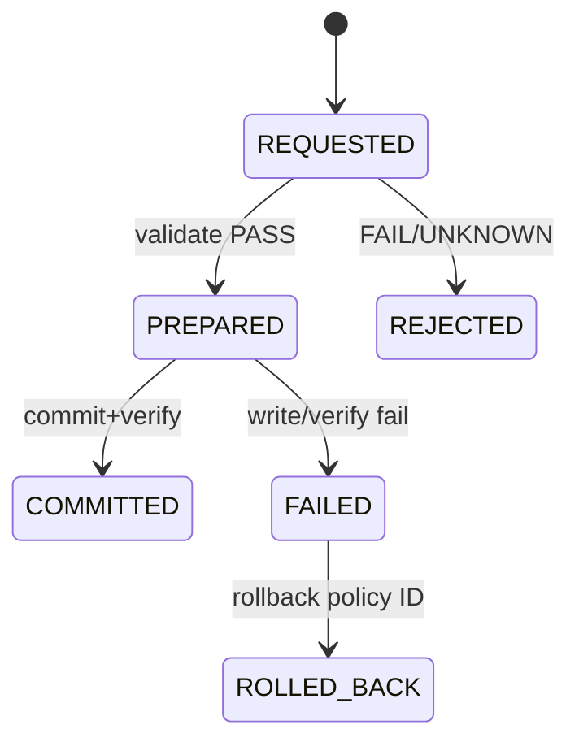

# Figure: Reconfiguration State Machine

See also `docs/r40-state-machine.md`.

```mermaid
stateDiagram-v2
  [*] --> REQUESTED
  REQUESTED --> PREPARED: validate PASS
  REQUESTED --> REJECTED: FAIL/UNKNOWN
  PREPARED --> COMMITTED: commit+verify
  PREPARED --> FAILED: write/verify fail
  FAILED --> ROLLED_BACK: rollback policy ID
```
